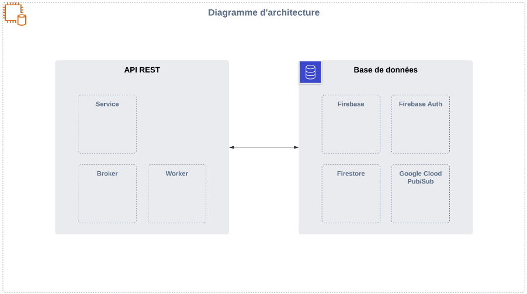

# Documentation Technique de l'API

## 1. Schéma d’architecture

### Infrastructure

#### Description générale de l'architecture
Notre API est construite sur une architecture de **microservices**, ce qui nous permet de développer, déployer et gérer les services de manière indépendante. Chaque microservice est responsable d'une fonctionnalité spécifique de l'application, ce qui améliore la modularité, la scalabilité et la résilience du système.

#### Composants principaux
Voici les principaux composants de notre architecture :

- **API** : Le point d'entrée principal pour les clients de l'API. Il reçoit les requêtes des clients, les traite et les transmet aux services appropriés.
- **Bases de données** : Utilisées pour stocker les données de l'application. Nous utilisons Firestore comme base de données principale pour sa flexibilité et ses capacités en temps réel.
- **Broker de messages** : Gère la communication asynchrone entre les microservices. Il permet de découpler les services et de garantir une communication fiable.
- **Worker** : Responsable de l'exécution des tâches en arrière-plan. Les workers traitent les messages du broker et effectuent des opérations lourdes ou asynchrones.

#### Diagramme d'architecture
Voici un diagramme de l'architecture de notre système :

### Dépendances

#### Services externes intégrés
Nous intégrons plusieurs services externes pour améliorer les fonctionnalités de notre application :

- **Firestore** : Utilisé comme base de données pour stocker et synchroniser les données en temps réel.
- **Firebase Auth** : Gère l'authentification des utilisateurs, supportant plusieurs méthodes d'authentification (email/mot de passe, OAuth, etc.).
- **Google Cloud Pub/Sub** : Utilisé pour déployer des systèmes de communication entre applications et services via des modèles de publication-abonnement.

#### Protocoles de communication utilisés
Nous utilisons **HTTPS** pour toutes les communications entre les clients et l'API, ainsi qu'entre les microservices. HTTPS garantit que toutes les données échangées sont chiffrées en transit, protégeant ainsi les informations sensibles contre les interceptions et les attaques.

En utilisant une architecture de microservices avec des composants bien définis et des services externes intégrés, nous assurons une application robuste, flexible et capable de s'adapter aux besoins futurs.

## 2. Sécurité de l’API

### Authentification

#### Méthodes d'authentification supportées
Nous utilisons **Firebase Auth** pour gérer l'authentification des utilisateurs. Les méthodes d'authentification supportées incluent :
- **Email et mot de passe** : Les utilisateurs peuvent s'inscrire et se connecter en utilisant leur adresse email et un mot de passe.
- **Authentification via les fournisseurs OAuth (en cours d'implémentation)** : Support pour Google, Facebook, Twitter, GitHub, et autres.
- **Authentification anonyme (en cours d'implémentation)** : Les utilisateurs peuvent utiliser l'application sans créer de compte, avec la possibilité de lier leur compte anonyme à une méthode d'authentification permanente plus tard.

### Autorisation

#### Stratégies de contrôle d'accès
Les stratégies de contrôle d'accès sont définies à l'aide des **règles Firebase**. Ces règles permettent de contrôler l'accès aux différentes ressources de l'API en fonction de l'authentification et des rôles des utilisateurs. Voici quelques exemples de stratégies utilisées :
- **Contrôle basé sur l'utilisateur** : Seuls les utilisateurs authentifiés peuvent accéder à certaines ressources.
- **Contrôle basé sur les rôles** : Différents niveaux d'accès sont accordés en fonction du rôle de l'utilisateur (administrateur, utilisateur standard, etc.).
- **Contrôle basé sur les attributs** : Accès aux ressources en fonction des attributs spécifiques de l'utilisateur (par exemple, l'appartenance à un groupe).

### Protection contre les attaques

#### Mesures de sécurité
Pour protéger l'API contre les attaques, nous utilisons plusieurs mesures de sécurité fournies par **Firebase** :
- **Protection contre les attaques par force brute** : Firebase Auth inclut des mécanismes de limitation de débit pour empêcher les attaques par force brute sur les tentatives de connexion.
- **Sécurisation des communications** : Toutes les communications entre les clients et l'API sont sécurisées via HTTPS, assurant que les données échangées sont chiffrées en transit.
- **Vérification des tokens** : Les tokens d'authentification sont vérifiés pour chaque requête, garantissant que seuls les utilisateurs authentifiés peuvent accéder aux ressources protégées.
- **Règles de sécurité pour la base de données** : Les règles Firebase pour Firestore et Realtime Database sont utilisées pour restreindre l'accès et garantir que seules les requêtes autorisées peuvent modifier les données.

## 3. Langage de programmation

### Choix du langage

#### Justification du langage utilisé
Nous avons choisi **C#** avec le framework **.NET** pour le développement de notre API. Voici les raisons principales de ce choix :

- **Performance** : C# est un langage compilé, offrant des performances supérieures par rapport aux langages interprétés. Le framework .NET est également optimisé pour les applications de haute performance et permet une gestion efficace de la mémoire grâce au garbage collector intégré.
- **Support** : .NET est activement maintenu par Microsoft, assurant un support continu, des mises à jour régulières, et des améliorations constantes. L'écosystème .NET est riche en bibliothèques et en outils qui facilitent le développement et la maintenance des applications.
- **Expérience d'équipe** : Notre équipe possède une expérience significative avec C# et .NET, ce qui réduit la courbe d'apprentissage et nous permet de développer plus rapidement des solutions robustes et maintenables.

### Frameworks et outils

#### Frameworks utilisés pour le développement de l'API
- **.NET** : Nous utilisons le framework .NET pour le développement de notre API. .NET offre un environnement de développement complet et performant pour créer des applications web, des services, et des APIs. Il supporte de nombreux standards de l'industrie et facilite l'intégration avec d'autres systèmes et technologies.

#### Outils de développement
Nous utilisons une variété d'outils pour le développement et les tests de notre API afin de garantir efficacité et qualité :

- **Rider** : Un IDE développé par JetBrains, Rider est particulièrement apprécié pour ses fonctionnalités avancées de refactoring, son inspection de code et son support de développement multi-plateformes.
- **Visual Studio** : L'IDE de Microsoft est une référence pour le développement en C# et .NET. Il offre des outils puissants de débogage, des intégrations avec Azure et des fonctionnalités avancées pour le développement collaboratif.
- **Postman** : Un outil essentiel pour le développement et le test d'APIs, Postman permet de créer et d'exécuter des requêtes HTTP, d'automatiser les tests d'APIs, et de documenter les endpoints de manière efficace.

En utilisant ces frameworks et outils, nous nous assurons que notre processus de développement est efficace, que notre code est de haute qualité, et que notre API répond aux besoins des utilisateurs de manière fiable et performante.

## 4. Règles d’hébergement

### Infrastructure d'hébergement

#### Docker
Nous utilisons **Docker** pour la gestion de l'infrastructure d'hébergement de notre API. Voici quelques points clés concernant l'utilisation de Docker :

- **Isolation des Environnements** : Chaque service de l'API est isolé dans son propre conteneur Docker, ce qui garantit que les dépendances et les configurations de chaque service n'interfèrent pas les unes avec les autres.
- **Portabilité** : Les conteneurs Docker peuvent être déployés de manière cohérente sur différents environnements (développement, test, production), ce qui réduit les problèmes liés aux différences de configuration.
- **Scalabilité** : Docker facilite le scaling horizontal de l'API. En cas de besoin, des instances supplémentaires des conteneurs peuvent être lancées pour gérer une charge accrue.
- **Gestion des Dépendances** : Toutes les dépendances nécessaires pour exécuter les services de l'API sont encapsulées dans les conteneurs Docker, assurant que chaque service dispose de l'environnement exact dont il a besoin.
- **CI/CD** : L'intégration de Docker avec les pipelines CI/CD (Intégration Continue et Déploiement Continu) permet une livraison rapide et fiable des mises à jour de l'API. Les images Docker peuvent être construites, testées et déployées automatiquement.

## 5. Gestion du code source

### Contrôle de version

#### Système de contrôle de version utilisé
Nous utilisons **GitHub** comme plateforme de gestion de code source et **Gitflow** comme modèle de branchement pour organiser notre travail. GitHub nous permet de collaborer efficacement, de suivre les modifications et de gérer les versions de notre code source.

#### Stratégies de branching et de merging
Pour assurer une gestion efficace des branches et des fusions, nous suivons les stratégies suivantes :

- **Branche Feature** : Chaque nouvelle fonctionnalité ou correctif est développé dans une branche dédiée nommée `feature/nom-de-la-fonctionnalité`. Cette approche permet de travailler sur plusieurs fonctionnalités en parallèle sans interférer avec le code principal.
- **Pull Request** : Une fois qu'une fonctionnalité est terminée, une pull request (PR) est créée vers la branche `master`. Cette PR inclut une description détaillée des changements apportés et des instructions pour tester la fonctionnalité.
- **Review d'un autre développeur** : Avant la fusion de la PR, le code est examiné par un autre développeur pour assurer la qualité et la conformité avec les normes de codage. Cette revue de code permet de détecter les erreurs potentielles et d'améliorer la qualité globale du code.

### Pratiques de développement

#### Normes de codage
Nous suivons des normes de codage strictes pour garantir la lisibilité, la maintenabilité et la cohérence du code. Voici quelques-unes des principales normes que nous appliquons :
- **Nommage cohérent** : Utilisation de noms de variables, de fonctions et de classes descriptifs et cohérents.
- **Commentaire et documentation** : Ajout de commentaires clairs et concis pour expliquer le code complexe et les décisions de conception. Utilisation de la documentation XML pour les méthodes et les classes publiques.
- **Structure et organisation** : Organisation du code en modules et en classes logiques. Utilisation de conventions de formatage cohérentes (indentation, espacement, etc.).

#### Tests automatisés
Les tests automatisés sont une partie essentielle de notre processus de développement pour assurer la qualité et la fiabilité de notre code. Nous utilisons des tests unitaires pour vérifier que chaque composant fonctionne comme prévu.

- **Tests Unitaires** : Les tests unitaires sont écrits pour chaque fonctionnalité afin de valider son comportement de manière isolée. Nous utilisons des frameworks de test comme **xUnit** pour .NET.
- **Intégration Continue** : Les tests unitaires sont exécutés automatiquement dans le cadre de notre pipeline d'intégration continue (CI). Chaque fois qu'une PR est soumise, un ensemble de tests est exécuté pour vérifier que les changements n'introduisent pas de régressions.

## 6. Gestion du déploiement (CI / CD)

### Intégration continue (CI)

#### Outils CI utilisés
Nous utilisons les outils suivants pour notre processus d'intégration continue :
- **Docker** : Pour créer des images containerisées de notre application, garantissant une exécution cohérente et isolée à travers différents environnements.
- **GitHub Actions** : Pour automatiser les workflows CI/CD, y compris la construction, le test et le déploiement de l'application.
- **SonarQube** : Pour l'analyse de la qualité du code et la détection des bugs, des vulnérabilités de sécurité, et des problèmes de maintenabilité.

### Livraison continue (CD)

#### Pipeline de déploiement
Le pipeline de déploiement est actuellement en cours de développement. Une fois terminé, il inclura les étapes suivantes :
- **Déploiement vers un environnement de staging** : Les changements sont d'abord déployés dans un environnement de staging pour des tests supplémentaires.
- **Validation** : Des tests d'intégration et des tests de bout en bout sont exécutés dans l'environnement de staging pour valider les modifications.

#### Stratégies de déploiement
Les stratégies de déploiement sont également en cours de développement. Voici quelques stratégies potentielles :
- **Déploiement progressif (Canary Releases)** : Déploiement initial à un sous-ensemble d'utilisateurs pour surveiller les performances et les erreurs avant de déployer à tous les utilisateurs.
- **Déploiement bleu-vert** : Maintien de deux environnements de production identiques, avec basculement entre eux pour minimiser les interruptions de service.
- **Rollback automatisé** : En cas de problème, retour automatique à la version précédente du déploiement pour minimiser l'impact sur les utilisateurs.

En suivant ces pratiques CI/CD, nous assurons un processus de déploiement fluide, fiable et reproductible, garantissant que notre application est toujours dans un état de déploiement prêt pour la production.
